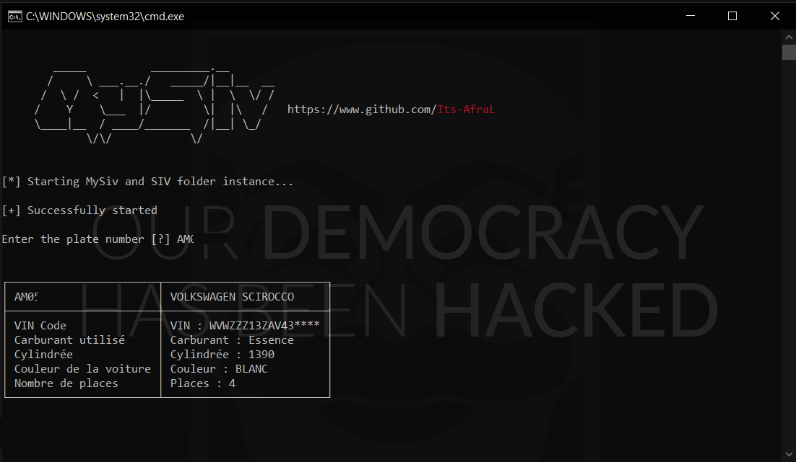

# MySiv 🔎🚗
MySiv is a **OSINT** python tool to find information about a **car plate number** *created by AfraL*

<p align="center">

</p>


Disclaimer: **FOR EDUCATIONAL PURPOSE ONLY! I will not assume any responsibility for the use of this tool.**

Warning: It's litteraly **impossible** to return a name and first name with a plate number if you are not a state official (police man for example) so this tool is **really powerful** to find **information of the car** not about the car owner

## Installation ⚙️

1. Fork/Clone/Download this repo

    `git clone https://github.com/Datalux/Osintgram.git`

2. Navigate to the directory

    `cd Osintgram`

3. Start install.bat or use pip to download requirements
  
    `pip install -r requirements.txt`
    
4. Start main.py file using Python

    `python main.py`
    
### Requirements

This OSINT Tool was created in Python3, so make **sure you have python installed on your computer**
    
    `https://www.python.org/downloads/`

The python modules required are :
```python
selenium
terminaltables
colorama
```

## Thanks for use ! 💡

